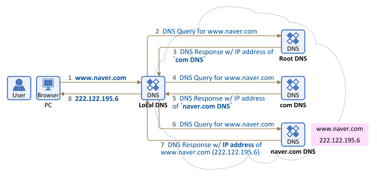
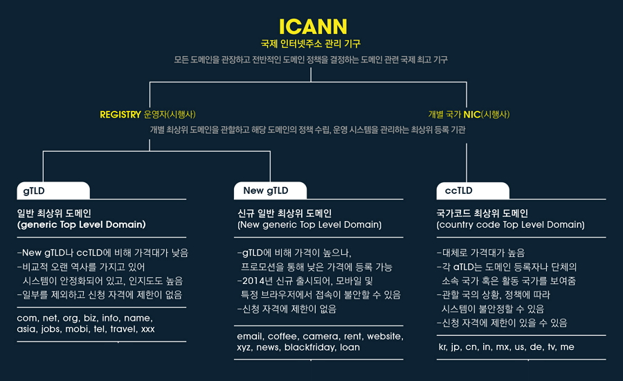

# 인터넷은 어떻게 동작하는가?
> 해당 문서는 [인터넷은 어떻게 동작하는가?](https://developer.mozilla.org/ko/docs/Learn/Common_questions/How_does_the_Internet_work) 를 참조했습니다.
## 요약
`인터넷` - 웹의 핵심적인 기술! 컴퓨터들이 서로 통신 가능한 거대한 네트워크

인터넷의 역사 
- 1960년대 미육군에서 기금한 연구프로젝트에서 시작
- 1980년대 많은 국립 대학과 비공개 기업의 지원으로 공공의 기반으로 변화
- 인터넷을 지원하는 다양한 기술은 시간이 자남에 따라 진화, But 작동 방식은 그대로!

**인터넷은 모든 컴퓨터를 연결하고 어떤 일이 있어도 연결 상태를 유지할 수 있는 방법을 찾는 방법이다.**

## 활동적으로 배우기
들어가기에 앞서 도움이 된 영상 : [링크](https://www.youtube.com/watch?v=Pwf-YG--Zsg)

## 깊게 들어가기
### 단순한 네트워크
- 두 개의 컴퓨터가 통신이 필요할 때
    - 다른 컴퓨터와 물리적으로(`이더넷` 케이블) 또는 무선(WiFi or 블루투스)으로 연결되어야함.
- 그 이상이라면?
    - (N*(N-1))/2 만큼의 케이블이 필요함! 즉 매우 복잡해진다.
    - 해결 방안
        - 네트워크의 각 컴퓨터는 `라우터` 라고 하는 특수한 소형 컴퓨터에 연결되는데, 라우터가 중앙에서 철도역의 신호원처럼 메시지를 보내주는 역할을 수행해주면 케이블수를 확연히 줄일 수 있다!
        - 라우터 역할: 철도역의 신호원처럼 주어진 컴퓨터에서 보낸 메시지가 올바른 대상 컴퓨터에 도착하는지 확인!

## 네트워크 속의 네트워크
- 만약, 수백, 수천, 수십억 대의 컴퓨터를 연결하려면?
    - 컴퓨터를 라우터에 연결하고, 라우터에서 라우터로 무한히 확장하면 됨!
    - But, 내 집(부산)에서 서울까지 케이블로 연결이 가능한가? No!
        - 해결 방안
            - 이미 집에 연결되어 있는 '전화 케이블' 사용한다.
            - Why? 전화기 기반의 시설은 이미 모든 세계와 연결되어 있으므로 이보다 완벽한 배선이 없다.
        - 우리의 네트워크를 전화 시설과 연결하기 위해선 `모뎀` 이라는 특수장비 필요!
            - 모뎀의 역할: 네트워크의 정보를 전화시설에서 처리할 수 있는 정보로 바꿈! (역도 성립)
        - 우리의 네트워크가 전화 시설에 연결 -> 도달하려는 네트워크로 메시지 전송
            - 이때, 메시지 전송은 `인터넷 서비스 제공업체(Internet Service Provider, ISP)`에서 담당함.
            - ISP: 다른 ISP의 라우터에도 액세스 할 수 있는 회사 (ex. LG U+, SKT, KT 등)

## 컴퓨터 찾기
- 컴퓨터에서 메시지를 보내려면 메시지를 받을 특정 컴퓨터를 지정해야한다.
    - So, 네트워크에 연결된 모든 컴퓨터에는 'IP주소'라는 고유한 주소가 존재
    - `IP주소`: 점으로 구분된 네 개의 숫자로 구성된 주소 (ex. 192.168.2.10.)
    - But, 인간은 IP주소를 기억하기 힘듦 -> 인간이 기억하기 쉬운 `도메인 이름` 사용 (ex. google.com)

## 인터넷과 웹
- 웹 브라우저에서 웹을 탐색할 때 일반적으로 도메인 이름을 사용하여 웹사이트 접속
    - 오! 그럼 인터넷 = 웹? No~
    - 인터넷 - 수십 억 대의 컴퓨터를 모두 연결하는 기술 인프라
    - 웹 = 그 인프라 기반 위에 구축된 서비스
    - 이러한 컴퓨터들 중 일부는 '웹 서버' -> 웹 브라우저가 이해할 수 있는 서비스 제공

# HTTP는 무엇일까요?
> 해당 문서는 [What is HTTP?](https://velog.io/@surim014/HTTP%EB%9E%80-%EB%AC%B4%EC%97%87%EC%9D%B8%EA%B0%80) 를 참조했습니다.

## HTTP (HyperText Transfer Protocol)
- 텍스트 기반의 통신 규약
- **인터넷에서 데이터를 주고받을 수 있는 프로토콜**이다.
- 이렇게 규약을 정해두었기 때문에 모든 프로그램이 이 규약에 맞춰 개발해서 서로 정보를 교환할 수 있게 되었다.

### HTTP 동작
- `클라이언트`(사용자)가 브라우저를 통해서 어떠한 서비스를 url을 통하거나 다른 것을 통해서 `요청`(request)을 하면 서버에서는 해당 요청사항에 맞는 결과를 찾아서 사용자에게 `응답`(response)하는 형태로 동작한다.
    > 요청 : client -> server

    > 응답 : server -> client

- HTML 문서만이 HTTP 통신을 위한 유일한 정보 문서는 아님.
- Plain Text로 부터 JSON 데이터 및 XML과 같은 형태의 정보도 주고 받을 수 있다.
- 보통은 클라이언트가 어떤 정보를 HTML 형태로 받고 싶은지, JSON 형태로 받고 싶은지 명시해주는 경우가 많음.

### HTTP 특징
- HTTP 메시지는 HTTP 서버와 HTTP 클라이언트에 의해 해석이 된다.
- TCP/IP를 이용하는 응용 프로토콜이다.
  (컴퓨터와 컴퓨터간에 데이터를 전송 할 수 있도록 하는 장치로 인터넷이라는 거대한 통신망을 통해 원하는 정보(데이터)를 주고 받는 기능을 이용하는 응용 프로토콜)
- HTTP는 연결 상태를 유지하지 않는 비연결성 프로토콜 (이러한 단점을 해결하기 위해 Cookie와 Session이 등장)
- HTTP는 연결을 유지하지 않는 프로토콜이기 때문에 요청/응답 방식으로 동작

### 예시로 알아보는 HTTP
> 서버 : 어떠한 자료에 대한 접근을 관리하는 네트워크 상의 시스템

> 클라이언트 : 그 자료에 접근할 수 있는 프로그램 (ex. 웹 브라우저, 핸드폰 어플리케이션 등...)

1) 클라이언트 프로그램에서 사용자가 회원가입 시도
2) 서버로 회원정보 전송
3) 서버는 회원정보 저장

**이 과정에서 클라이언트와 서버 간의 교류가 HTTP라는 규약을 이용하여 발생**

## Request (요청)
- 요청 : **클라이언트가 서버에게 연락하는 것**
- 요청을 보낼때는 요청에 대한 정보를 담아 서버로 전송

### Request Method (요청의 종류)
- GET : 자료를 `요청`할 때 사용
- POST : 자료의 `생성`을 요청할 때 사용
- PUT : 자료의 `수정`을 요청할 때 사용
- DELETE : 자료의 `삭제`를 요청할 때 사용

### Request HTTP 메시지 예시
~~~
GET https://velog.io/@surim014 HTTP/1.1								// 시작줄
User-Agent: Mozilla/5.0 (Windows NT 10.0; Win64; x64) ...			  // 헤더
Upgrade-Insecure-Requests: 1

~~~
1. 시작줄 (첫 줄)
- 첫 줄은 시작줄로 **메서드 구조 버전**으로 구성
    - GET : HTTP Method
    - https://velog.io/@surim04 : 사이트 주소
    - HTTP/1.1 : HTTP 버전
2. 헤더 (두 번째 줄부터)
- 두번째 줄부터는 헤더이며 **요청에 대한 정보**를 담고 있다. User-Agent, Upgrade-Insecure-Requests 등등이 헤더에 해딩되며 헤더의 종류는 매우 많다.
3. 본문 (헤더에서 한 줄 띄고)
- 본문은 **요청을 할 때 함께 보낼 데이터를 담는 부분**이다. 현재 예시에는 단순히 주소로만 요청을 보내고 있고 따로 데이터를 담아 보내지 않기 때문에 본문이 비어있다.

## Response (응답)
**서버가 요청에 대한 답변을 클라이언트에게 보내는 것**을 응답이라고 한다.

### Status Code (상태 코드)
- 상태 코드에는 굉장히 많은 종류가 존재. 모두 숫자 세 자리로 이루어져있으며, 아래와 같이 크게 다섯 부류로 나눔.
    - **1XX(조건부 응답)** : 요청을 받았으며 작업을 계속한다.
    - **2XX(성공)** : 클라이언트가 요청한 동작을 수신하여 이해했고 승낙했으며 성공적으로 처리했음을 가리킨다.
    - **3XX(리다이렉션 완료)** : 클라이언트는 요청을 마치기 위해 추가 동작을 취해야 한다.
    - **4XX(요청 오류)** : 클라이언트에 오류가 있음을 나타낸다.
    - **5XX(서버 오류)** : 서버가 유효한 요청을 명백하게 수행하지 못했음을 나타낸다.

### Response HTTP 메시지 예시
~~~
HTTP/1.1 200 OK														// 시작줄
Connection: keep-alive												 // 헤더
Content-Encoding: gzip												 
Content-Length: 35653
Content-Type: text/html;

<!DOCTYPE html><html lang="ko" data-reactroot=""><head><title...
~~~
1. 시작줄 (첫 줄)
- 첫 줄은 **버전 상태코드 상태메시지**로 구성. 200은 성공적인 요청이었다는 뜻.

2. 헤더 (두 번째 줄부터)
- 두 번째 줄부터는 헤더로 **응답에 대한 정보를 담고 있다**.

3. 본문 (헤더 뒤부터)
- 응답에는 대부분의 경우 본문이 있다. 보통 데이터를 요청하고 응답 메시지에는 **요청한 데이터를 담아서 보내주기 때문이다. 응답 메시지에 HTML이 담겨 있는 이 HTML을 받아 브라우저가 화면에 렌더링한다.**

# 도메인 네임은 무엇일까요?
> 해당 문서는 [DomainName과 HostName](https://real-dongsoo7.tistory.com/122) 를 참조했습니다.
## 도메인 네임이란?
- 도메인네임(DomainName)이란 넓은 의미로는 **네트워크 상에서 컴퓨터를 식별하는 호스팅명**을 가리키며, 좁은 의미에서는 **도메인 레지스트레에게서 등록된 이름**을 의미한다.
- 간단히, 우리가 네트워크상에서 원하는 호스트를 가리키는 이름!
- 네이버를 예를 들면, 네이버는 naver.com이라는 도메인 주소를 갖는다. 우리가 웹 브라우저에 해당 주소를 입력하면 브라우저는 각각의 도메인 영역을 관리하는 DNS 서버에 요청을 보내서 해당 주소가 가르키는 위치가 어디인지 확인하여 반환한다.
> 호스트 네임(Hostname, NodeName)이란, 네트워크에 연결된 장치들에게 부여되는 각각의 고유한 이름이다. 우리가 도메인 주소를 생성하고 나면 서비스를 구분하기 위해 별도의 서브 도메인을 사용하기도 한다. (ex. 네이버의 메일 서비스는 mail.naver.com / 웹툰의 경우 comic.naver.com)

# DNS와 작동원리
> 해당 문서는 [DNS와 작동원리](https://velog.io/@goban/DNS%EC%99%80-%EC%9E%91%EB%8F%99%EC%9B%90%EB%A6%AC) 를 참조했습니다.
## DNS란?
- DNS의 사전적인 정의
    > 도메인 네임 시스템(Domain Name System, DNS)은 호스트의 도메인 이름을 호스트의 네트워크 주소로 바꾸거나 그 반대의 변환을 수핼할 수 있도록 하기 위해 개발되었다. - 위키백과
- 우리가 자주 접하는 naver.com, google.com 모두 DNS을 가진 DN(Domain Name)이라고 할 수 있다.

## DNS의 작동원리
아래의 그림은 DNS가 어떻게 작동하는지 보여준다.

1. 웹 브라우저에 www.naver.com을 입력하면 먼저 Local DNS에게 "www.naver.com"이라는 hostname에 대한 IP 주소를 질의하여 Local DNS에 없으면 다른 DNS name 서버 정보를 받음(Root DNS 정보 전달 받음)
> Root DNS(루트 네임서버)는 인터넷의 도메인 네임 시스템의 루트 존이다. 루트 존의 레코드의 요청에 직접 응답하고 적절한 최상위 도메인에 대해 권한이 있는 네임 서버 목록을 반환함으로써 다른 요청에 응답한다. 전세계에 961개의 루트 DNS가 운영되고 있다.
2. Root DNS 서버에 "www.naver.com" 질의
3. Root DNS 서버로 부터 "com 도메인"을 관리하는 **TLD (Top-Level Domain)** 이름 서버 정보 전달 받음
> 여기서 TLD는 .com을 관리하는 서버를 칭함
4. TLD에 "www.naver.com" 질의
5. TLD에서 "naver.com" 관리하는 DNS 정보 전달
6. "naver.com" 도메인을 관리하는 DNS 서버에 "www.naver.com" 호스트네임에 대한 IP 주소 질의
7. Local DNS 서버에게 "응! www.naver.com에 대한 IP 주소는 222.122.195.6" 응답
8. Local DNS는 www.naver.com에 대한 IP 주소를 캐싱을 하고 IP 주소 정보 전달

## TLD의 구조

- 최상위 ICANN 아래에 REGISTRY, NIC이 있고 REGISTRY 아래에 우리가 흔히 보는 gTLD, new gTLD가 있고 NIC 아래에는 공공사이트에서 쓰는 ccTLD 도메인 주소가 있다.

# 브라우저는 어떻게 동작하는가?
> 해당 문서는 [브라우저는 어떻게 동작하는가?](https://d2.naver.com/helloworld/59361) 를 참조했습니다.
## 소개
### 브라우저의 주요 기능
- 브라우저의 주요 기능은 **사용자가 선택한 자원을 서버에 요청하고 브라우저에 표시하는 것이다.**
- 자원은 보통 HTML 문서지만 PDF나 이미지 또는 다른 형태일 수 있다.
- 자원의 주소는 URI(Uniform Resource Identifier)에 의해 정해진다.
- 브라우저는 HTML과 CSS 명세에 따라 HTML 파일을 해석해서 표시한다.
    - 이 명세는 웹 표준화 기구인 W3C(World Wide Web Consortium)에서 정한다.

### 브라우저의 기본 구조
- 브라우저의 주요 구성 요소는 다음과 같다.
    1. 사용자 인터페이스 - 주소 표시줄, 이전/다음 버튼, 북마크 메뉴 등. 요청한 페이지를 보여주는 창을 제외한 나머지 모든 부분이다.
    2. 브라우저 엔진 - 사용자 인터페이스와 렌더링 엔진 사이의 동작을 제어.
    3. 렌더링 엔진 - 요청한 콘텐츠를 표시. 예를 들어 HTML을 요청하면 HTML과 CSS를 파싱하여 화면에 표시.
    4. 통신 - HTTP 요청과 같은 네트워크 호출에 사용됨. 이것은 플랫폼 독립적인 인터페이스이고 각 플랫폼 하부에서 실행됨.
    5. UI 백엔드 - 콤보 박스와 창 같은 기본적인 장치를 그림. 플랫폼에서 명시하지 않은 일반적인 인터페이스로서, OS 사용자 인터페이스 체계를 사용.
    6. 자바스크립트 해석기 - 자바스크립트 코드를 해석하고 실행.
    7. 자료 저장소 - 이 부분은 자료를 저장하는 계층이다. 쿠키를 저장하는 것과 같이 모든 종류의 자원을 하드 디스크에 저장할 필요가 있다. HTML5 명세에는 브라우저가 지원하는 '웹 데이터 베이스'가 정의되어 있다. 

- 크롬은 대부분의 브라우저와 달리 각 탭마다 별도의 렌더링 엔진 인스턴스를 유지하는 것이 주목할만하다. 각 탭은 독립된 프로세스로 처리된다.

## 렌더링 엔진
- 렌더링 엔진의 역할은 요청 받은 내용을 브라우저 화면에 표시하는 일이다.
- 렌더링 엔진은 HTML 및 XML 문서와 이미지를 표시할 수 있다.
> 물론 플러그인이나 브라우저 확장 기능을 이용해 PDF와 같은 다른 유형도 표시할 수 있다. 그러나 이 장에서는 HTML과 이미지를 CSS로 표시하는 주된 사용 패턴에 초점을 맞출 것이다.

### 렌더링 엔진들
- 파이어폭스와 크롬, 사파리는 두 종류의 렌더링 엔진으로 제작되었다. 파이어폭스는 모질라에서 직접 만든 게코(Gecko) 엔진을 사용하고 크롬은 웹킷(Webkit) 엔진을 사용한다.
- 웹킷은 최초 리눅스 플랫폼에서 동작하기 위해 제작된 오픈소스 엔진인데 애플이 맥과 윈도우즈에서 사파리 브라우저를 지원하기 위해 수정을 가했다. ([webkit.org](https://webkit.org/) 참조)

### 동작 과정
- 렌더링 엔진은 통신으로부터 요청한 문서의 내용을 얻는 것으로 시작하는데 문서의 내용은 보통 8KB 단위로 전송된다.

1. 렌더링 엔진은 HTML 문서를 파싱하고 "콘텐츠 트리" 내부에서 태그를 DOM 노드로 변환한다.
    - 그 다음 외부 CSS 파일과 함께 포함된 스타일 요소도 파싱한다.
2. 스타일 정보와 HTML 표시 규칙은 "렌더 트리"라고 부르는 또 다른 트리를 생성한다.
    - 렌더 트리는 색상 또는 면적과 같은 시각적 속성이 있는 사각형을 포함하고 있는데 정해진 순서대로 화면에 표시한다.
3. 렌더 트리 생성이 끝나면 배치가 시작되는데 이것은 각 노드가 화면의 정확한 위치에 표시되는 것을 의미한다.
4. 다음은 UI 백엔드에서 랜더 트리의 각 노드를 가로지르며 형상을 만들어 내는 그리기 과정이다.
- 일련의 과정들의 점진적으로 진행된다는 것을 아는 것이 중요! 렌더링 엔진은 좀 더 나은 사용자 경험을 위해 가능하면 빠르게 내용을 표시하는데 모든 HTML을 파싱할 때까지 기다리지 않고 배치와 그리기 과정을 시작한다.

### 동작 과정 예
<웹킷 동작 과정> 
 
<모질라의 게코 렌더링 엔진 동작 과정> 

- 웹킷과 게코가 용어를 약간 다르게 사용하고 있지만 동작 과정은 기본적으로 동일하다.
- 게코는 시각적으로 처리되는 렌더 트리를 "형상 트리(frame tree)"라고 부르고 각 요소를 형상(frame)이라고 하는데 웹킷은 "렌더 객체(render object)"로 구성되어 있는 "렌더 트리(render tree)"라는 용어를 사용한다.
- 웹킷은 요소를 배치하는데 "배치(layout)" 라는 용어를 사용하지만 게코는 "리플로(reflow)" 라고 부른다.
- "어태치먼트(attachment)"는 웹킷이 렌더 트리를 생성하기 위해 DOM 노드와 시각 정보를 연결하는 과정이다.
- 게코는 HTML과 DOM 트리 사이에 "콘텐츠 싱크(content sink)"라고 부르는 과정을 두는데 이는 DOM 요소를 생성하는 공정으로 웹킷과 비교하여 의미있는 차이점이라고 보지는 않는다.