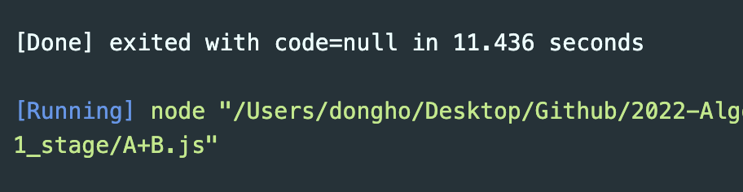

# 1주차(03.14~03.20)

## Stage 1 - 입출력과 사칙연산

### 2557번 Hello World

#### 깨달은 것

- 백준에서 node.js 출력은 `console.log()` 로 인식한다.

### 10718번 We love kriii

#### 깨달은 것

- 단순한 코드지만, 구글에 다른 사람들은 어떻게 했나 검색해보았다.

1. 단순히 똑같은 코드 2줄 반복 => 비효율적이라 거름

```js
console.log("강한친구 대한육군");
console.log("강한친구 대한육군");
```

2. 이스케이프 시퀀스 `\n` 사용 (내가 쓴 방법)

```js
console.log("강한친구 대한육군\n강한친구 대한육군");
```

- `이스케이프 시퀀스`: 프로그래밍 언어 특성 상 표현할 수 없는 기능, 문자를 표현해준다. 컴퓨터를 제어하는 목적으로 사용되는 특수한 문자이다.

3. 반복문 사용
4. 변수 사용

```js
const input = "강한친구 대한육군";

console.log(`${input}\n${input}`);
```

- 처음에는 보고 되게 의아했는데, 생각해보니 코드가 길어질 때는 요 방식을 더 많이 쓴다는걸 깨달았다. 짧은 코드라도 요런식으로 연습해야겠다. [링크](https://overcome-the-limits.tistory.com/entry/%EC%95%8C%EA%B3%A0%EB%A6%AC%EC%A6%98-%EB%B0%B1%EC%A4%80-10718-We-love-kriii-with-nodejs)

### 10171번 고양이

- `\`를 출력하려면 `\\` 두번 써줘야 하는 문제

#### 깨달은 것

- 처음에는 무지성으로 그냥 출력문을 4번 반복해서 적었는데, 다른 사람 코드를 보고 마음이 싹 바뀌었다.

```js
console.log(
  `\\    /\\
 )  ( ')
(  /  )
 \\(__)|`
);
```

- 다른 사람 같은 경우는 백틱(`) 기호를 사용해서 하나의 출력문에 여러 줄을 넣어서 출력되게 만들었다. 이게 더 코드 가독성이 좋은 것 같다.

### 10172번 개

- 마찬가지로 고양이 문제와 같이 풀었음. 몰랐는데 중간에 백틱 기호도 섞여 있어서 그것도 앞에 `\`를 붙여줘야했음 ㅋㅋ

### 1000번 A+B, 1001번 A-B

#### Node.js에서 입력값 받기

- 백준에서 node.js 입력값을 직접 입력하는게 아니라, 파일에서 불러오는 형식이라 특이했다. 그래서 따로 정리해보았다.

```js
let fs = require("fs");
let input = fs.readFileSync("/dev/stdin").toString().split(" ");
let a = parseInt(input[0]);
let b = parseInt(input[1]);
console.log(a + b);
```

- 파일 입출력 처리를 하기 위해서는 `fs`라는 모듈이 필요했다. `fs` 모듈은 Node.js에 내장되어 있기 때문에 설치없이 바로 불러와서 사용할 수 있다. `require("fs");`

- 백준에서 테스트 케이스는 파일로 존재하고, `fs.readFileSync("/dev/stdin").toString()` 를 통해 `1 2` 라는 문자열을 읽어들인다. 여기서 split을 통해 문자열을 `띄어쓰기` 기준으로 끊어 배열로 반환한다. 그렇게 되면 `input = ["1", "2"]` 과 같이 input 배열에 한 줄씩 저장된다.

- 이렇게 만들어진 배열을 하나씩 끄집어내서 문자열으로 저장된 숫자를 `parseInt` 메소드를 이용해서 Int형으로 변환시켜 사용한다.

> 참고 사이트: [Node.js의 fs 모듈로 파일 입출력 처리하기](https://www.daleseo.com/js-node-fs/) | [백준 코딩 테스트 JavaScript로 입력받는 방법 정리](<https://grap3fruit.dev/blog/%EA%B5%AC%EB%A6%84(goorm),-%EB%B0%B1%EC%A4%80(BOJ)-%EC%BD%94%EB%94%A9-%ED%85%8C%EC%8A%A4%ED%8A%B8-JavaScript%EB%A1%9C-%EC%9E%85%EB%A0%A5%EB%B0%9B%EB%8A%94-%EB%B0%A9%EB%B2%95-%EC%A0%95%EB%A6%AC>)

#### Code Runner

- 이때까지는 자바스크립트를 실행시킬 때마다 크롬 웹브라우저로 콘솔창을 띄워서 확인을 했었는데, 너무 번거로웠다.
- 그래서 vs code에서 콘솔창을 확인하는 방법이 없을까 검색해보았는데 `Code Runner`라는 vs code 확장 프로그램을 알게돼서 바로 설치했다!



- 근데.. 프로그램이 실행만 되고 종료가 안되길래 30분 정도 삽질을 했는데, 이유는 `fs.readFileSync`의 비동기성 때문이였다. `/dev/stdin` 라는 폴더는 백준 자체에만 있지, 내 vs code에는 없다. 그래서 없는 폴더를 막연히 찾으려하니 프로세스가 안 돌아갈 수 밖에..

  > `readFile`과 `readFileSync`의 차이는 `비동기`와 `동기`의 차이이다. readFile을 사용하면 data를 가져오는 동안 멈추지 않고 다음 코드를 실행해버린다. readFileSync는 반대로 파일을 읽어오는 동안 전체 프로세스를 멈추고 데이터를 가져온 후 진행시킨다.

- 그래서 해결방법으로 vscode에서 코드를 테스트 할 때는 `input.txt` 파일을 따로 만들어 경로를 텍스트 파일로 설정하고, 백준에 제출을 할 때는 다시 `/dev/stdin` 으로 변경해서 제출했다.
