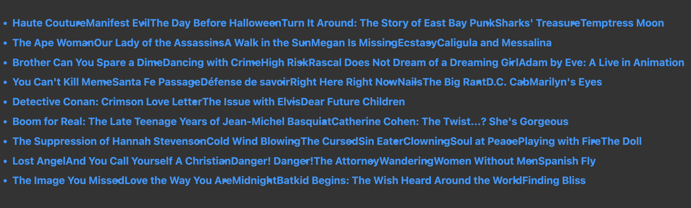

# 03.16(수)

## 유튜브 클론코딩 챌린지 삽질 모음

```
each movie in movies
  li movie
```

- 이렇게 적고 movie가 왜 반복되는지 이해를 못하고 있었다.. 바본가..

```
each movie in movies
  li=movie

// 혹은

each movie in movies
  li #{movie}
```

- 이게 맞는 문장이다!

---

```
each movie in movies
  a(href="")
    li=movie.title
```



- 왜인지는 모르겠는데 `<li>`를 `<a>`로 감싸니깐 저런식으로 나왔다.

---

```js
const { id } = req.params;
const movie = getMovieById(id);
return res.render("movie", { pageTitle: "Movies", movie });
```

```js
const { id } = req.params;
return res.render("movie", { pageTitle: "Movies", movie: getMovieById(id) });
```

- 위에껀 되고 아래껀 안되는데.. 이유를 모르겠다 한번 연구해봐야겠다.

- 아마 인자로 넘기는 부분에서 `movie` 로 넘기면 안되고 `movie: movie` 이런식으로 넘겨야 잘 되는 것 같다.
